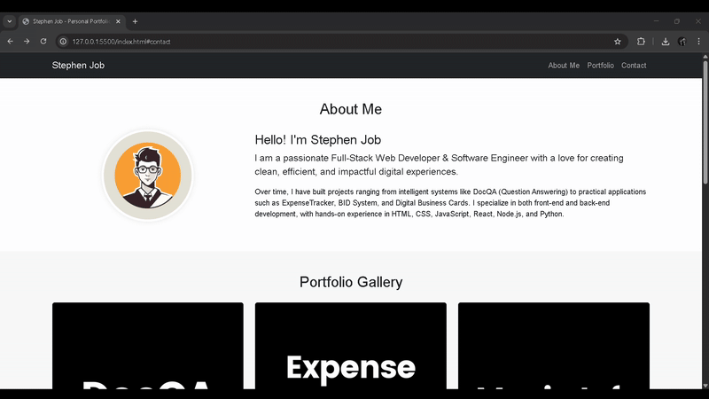

# 💼 Personal Portfolio Website

A responsive and professional **single-page portfolio** website built to showcase skills, projects, and contact information. Features a modern dark theme, smooth scrolling, and an interactive layout created with HTML, CSS, and Bootstrap.

---

## 🌐 Live Demo
[**View Live Demo**](https://abelalexander18.github.io/L-T/)

---

## 📸 Demo

*(Note: You can create a screenshot of your site and name it `screenshot.png` in your root folder to display it here.)*

---

## 🚀 Features
- **Modern Dark Theme UI**
- **Fully Responsive** for all devices
- **Single-Page** layout
- Smooth scrolling navigation
- Interactive portfolio gallery with hover effects
- Functional contact form
- Optimized for **GitHub Pages**

---

## 🛠 Tools & Technologies
**Languages & Frameworks**
- HTML5
- CSS3 (Animations, Custom Properties)
- Bootstrap 5 (Responsive Framework)

**Libraries & Assets**
- [jQuery](https://jquery.com/) (DOM Manipulation, Event Handling)
- Google Fonts (Typography)

**Tools**
- VS Code
- Git & GitHub

---

## 📂 Project Structure
```
L-T/
│
├── index.html      # Main HTML structure
├── style.css       # Custom styles and theme
├── script.js       # JavaScript for interactivity
├── images/         # Folder for profile and project images
└── README.md       # Project information file
```
---
## 🙌 Acknowledgements
- [Bootstrap](https://getbootstrap.com/) – For the powerful responsive framework.
- [jQuery](https://jquery.com/) – For simplifying JavaScript and event handling.

---

## 👥 Contributors
- [Abhishan Francis](https://github.com/falconishere)
- [Abel Alexader](https://github.com/abelalexander18)
- [Misheal Julian]()
